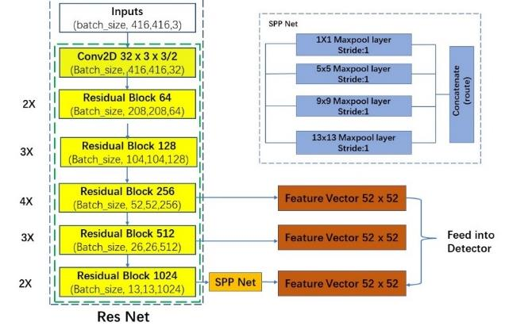
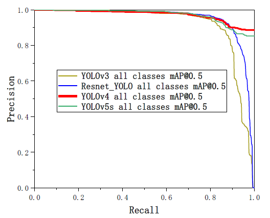
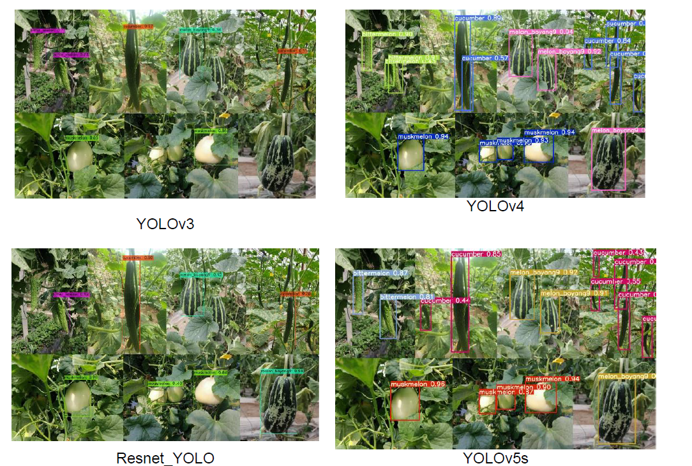

# Detection of cucurbits’ fruits based

### **[Detection of cucurbits’ fruits based on deep learning](https://www.engineeringvillage.com/search/quick.url?SEARCHID=ad9b2cab162442d48b46020a5aad0141&COUNT=1&usageOrigin=&usageZone=#foo), [INMATEH - Agricultural Engineering [bib](https://github.com/xieyonghao/DCFB-Deep-Learning)]**  
Fan ZHAO, Jiawei ZHANG, Na ZHANG, Zhiqiang TAN, [Yonghao XIE](https://github.io/xieyonghao), Song ZHANG, Zhe HAN, Mingbao LI*

In this paper, four models, YOLOv3, YOLOv4, YOLOv5s and improved Resnet_YOLO, were used to detect mixed bitter melon, cucumber, white melon, and "Boyang 9" melon fruits. Fruit images of bitter melon, cucumber, white melon and "Boyang 9" melon were collected under different natural conditions for model training.

## Introduction
<!-- <p align="center">
  <big><b>Detection of cucurbits’ fruits based on deep learning (INMATEH-Agricultural Engineering 2022)</b></big>
</p>


<p align="center">
  <big><b>Fan ZHAO, Jiawei ZHANG, Na ZHANG, Zhiqiang TAN, [Yonghao XIE], Song ZHANG, Zhe HAN, Mingbao LI*</b></big>
</p> -->

four models, YOLOv3, YOLOv4, YOLOv5s and improved Resnet_YOLO, were used to detect .  

<p align="center">
  
</p>

The improved Resnet_YOLO model performed best among the four models: the best weights size was the smallest at 14 MB; the better mAP value of 0.971 for all classes of cucurbits; and the fastest detection speed with fps of 90.9.

<p align="center">
  
</p>

This results shows that four types of cucurbit fruit images, bitter melon, cucumber, white melon, and "Boyang 9" melon, can be detected based on deep learning methods for hybrid detection.

<p align="center">
  
</p>


## Citation
```
@article{fan2022detection,
  title={DETECTION OF CUCURBITS'FRUITS BASED ON DEEP LEARNING.},
  author={Fan, ZHAO and ZHANG, Jiawei and ZHANG, Na and Zhiqiang, TAN and Yonghao, XIE and ZHANG, Song and Zhe, HAN and Mingbao, LI},
  journal={INMATEH-Agricultural Engineering},
  volume={66},
  number={1},
  year={2022}
}
```

## Acknowledgement

Thank you for the support of the National Key Technologies Research and Development Program of China.

## Contact

Mingbao Li(lmbnefu@126.com)
